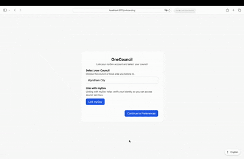
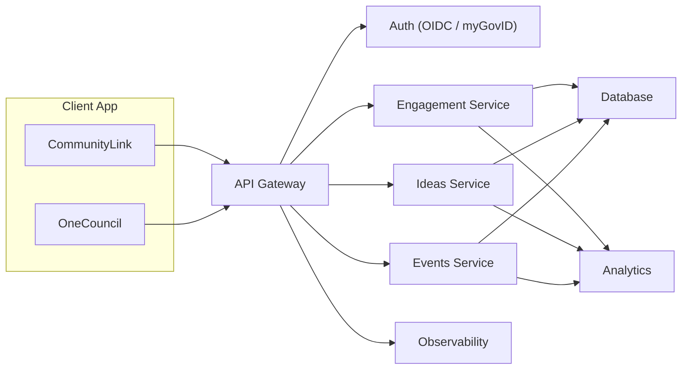

# CommunityLink

## Problem Statement

**Bridging Social Divides: Strengthening Social Connections in Australia**

How can we bring people together from diverse backgrounds to communicate respectfully, even when they hold opposing views?

Social cohesion is the “glue” that binds society together. Cohesive societies are healthier, more resilient, and experience greater prosperity. While Australians have historically come together in times of crisis, recent reports (Scanlon Institute 2023, 2024) show a decline in cohesion — with the Scanlon-Monash Index dropping to its lowest score since 2007.

Key dimensions of cohesion include:

* **Belonging** – pride and connection to Australian life and culture
* **Worth** – emotional and material well-being across society
* **Inclusion & Justice** – fairness in society and trust in government
* **Participation** – active engagement in political and civic life
* **Acceptance & Rejection** – attitudes to diversity and experiences of discrimination

This project addresses following  **GovHack challenges**: to design initiatives that strengthen community connection, trust in government, and respectful debate. Deliverables should:

* Bridging Social Divides: Bringing People Together to Strengthen Social Connections
* Using AI to Help Australians Navigate Government Services
* Connecting New Citizens to Australian Democracy

---

## Solution Overview

Our solution is **CommunityLink** – an AI-powered platform that brings residents and councils together.

The solution enables councils to:

* Discover and act on community sentiments.
* Provide safe, authentic channels for ideas and feedback.
* Support respectful dialogue without amplifying polarisation.
* Track participation and belonging indicators over time.
* Provide all the Current Services Councils have for residents.
* Provide New Citizen Charter for getting them used to Govt Services more easily.

### Key Features

* **OneCouncil, Multi-Tenant:** Single user experience across australia, council selection during onboarding. MyGov Integration for Authentication and OneCouncil Service in MyGov Portal.
* **Dual User Model:** Residents and Council Admins with tailored dashboards
* **Aggregated, Anonymous Engagement:** Protects privacy while surfacing actionable insights
* **Respectful Dialogue:** Sentiment aggregation reduces prominence of divisive content.
* **AI Summariser:** Optional AI-assisted summarisation to help frame proposals and community Ideas

---

## Technical Design

### Developer / Demo notes

This repository includes a lightweight developer/demo setup used for prototyping and presentation. These notes explain what is in the repo and how it differs from a production deployment:

- **Frontend (dev):** React (JSX), Vite (dev server)
- **Styling (dev):** TailwindCSS
- **Mock data:** static files under `src/mockData/` used to populate charts and tiles during development
- **Local tenancy (dev):** onboarding stores a selected council in local client state for fast prototyping. In production tenancy MUST be server-side and enforced by the backend.

### Production Stack (Recommended)

* **Frontend:** React served via CDN
* **API:** REST/GraphQL (serverless or containers)
* **Auth:** OIDC / myGovID (strong identity proofing)
* **Database:** Managed Postgres or NoSQL with tenant separation
* **Cache/Session:** Redis
* **Storage:** S3-compatible for attachments
* **Analytics:** Time-series DB or OLAP store


## User Journeys

**Residents**

* Onboard using MyGov Authentication Process / Provide Preferences during Onboarding
* Set preferences, browse events, register interest
* Submit ideas (AI summary assist)
* Vote/comment on proposals from Council (Support / Neutral / Oppose)
* Access existing council service flows (waste, parking, rates)



**Council Admins**

* Dashboard with belonging/trust scores and engagement snapshots
* Participation chart + sentiment hub
* View aggregated, anonymised signals to prioritise engagement
* Action Plans for fostering further Community Engagements Or Acting on Community Feedback.

---

## System Architecture (Prod)


**Notes (prod):**

* Tokens/sessions live in **HttpOnly, Secure, SameSite cookies** (gateway creates/rotates). No LocalStorage.
* **Tenant context** is derived server-side from identity → enforced via Postgres **RLS** or schema-per-tenant.
* Read paths for dashboards go through **Privacy/Aggregation Layer** so only thresholded, anonymised numbers ever reach clients.

---

## API Surface (concise)

### Auth & Session

| Method | Path                           | Description                                  | Auth           |
| ------ | ------------------------------ | -------------------------------------------- | -------------- |
| `GET`  | `/auth/start?provider=mygovid` | Begin OIDC flow                              | Public         |
| `GET`  | `/auth/callback`               | OIDC callback → sets HttpOnly session cookie | Public         |
| `POST` | `/auth/logout`                 | Clears session                               | Session cookie |

### Resident – Events/Prefs

| Method | Path                                                    | Description                                     |
| ------ | ------------------------------------------------------- | ----------------------------------------------- |
| `GET`  | `/api/v1/events?lga={id}&from=YYYY-MM-DD&to=YYYY-MM-DD` | List public events (tenant-scoped)              |
| `POST` | `/api/v1/events/{eventId}/interest`                     | Register interest                               |
| `GET`  | `/api/v1/preferences`                                   | Get user prefs                                  |
| `PUT`  | `/api/v1/preferences`                                   | Update prefs (categories, accessibility, times) |

**Example payloads**

```json
// PUT /api/v1/preferences
{
	"categories": ["arts_culture","sports"],
	"age_group": "18_34",
	"availability": ["weeknights","weekend_mornings"],
	"accessibility": ["step_free","quiet_space"]
}
```

### Resident – Ideas & Feedback

| Method | Path                         | Description                                 |
| ------ | ---------------------------- | ------------------------------------------- |
| `POST` | `/api/v1/ideas`              | Submit an idea (text + optional attachment) |
| `POST` | `/api/v1/ideas/{id}/vote`    | { "vote": "support|neutral|oppose" }     |
| `POST` | `/api/v1/ideas/{id}/comment` | Short, moderated comment                    |
| `POST` | `/api/v1/ideas/summarise`    | (Server-side) AI summary helper             |

**Example payloads**

```json
// POST /api/v1/ideas
{
	"title": "Pop-up multicultural food night",
	"body": "Partner with local groups to host monthly events in the town square.",
	"tags": ["belonging","youth","food"],
	"location_lga": "Whitehorse"
}

// POST /api/v1/ideas/summarise
{
	"text": "Partner with local groups to host monthly multicultural food nights..."
}
```

**Example responses**

```json
// 201 Created (idea)
{
	"id": "idea_01HZX...",
	"status": "received",
	"moderation": "pending"
}

// 200 OK (summary)
{
	"summary": "Monthly multicultural food nights to foster belonging and cross-cultural exchange.",
	"key_points": ["low-cost pilots", "partner local groups", "youth focus"]
}
```

### Admin – Cohesion & Engagement (Aggregated Only)

| Method | Path                                                  | Description                             |
| ------ | ----------------------------------------------------- | --------------------------------------- |
| `GET`  | `/api/v1/engagement/participation?lga={id}&months=12` | Time series index (aggregated)          |
| `GET`  | `/api/v1/engagement/sentiment?lga={id}`               | Aggregated sentiment per project/topic  |
| `GET`  | `/api/v1/ideas?lga={id}`                              | List ideas + vote tallies (thresholded) |

**Example responses**

```json
// GET /api/v1/engagement/participation
{
	"lga": "Whitehorse",
	"series": [
		{"month": "2024-01", "index": 62},
		{"month": "2024-02", "index": 64},
		{"month": "2024-03", "index": 67}
	],
	"method": "z-scored composite (events, ideas, votes, visits)"
}

// GET /api/v1/engagement/sentiment
{
	"lga": "Whitehorse",
	"topics": [
		{"topic": "parks_upgrade", "support": 132, "neutral": 41, "oppose": 28, "n": 201},
		{"topic": "night_markets", "support": 98, "neutral": 22, "oppose": 11, "n": 131}
	],
	"min_threshold": 10
}
```

---


## Benefits

* Strengthens belonging and connection.
* Builds trust in government through transparency.
* Encourages constructive dialogue over polarisation in decision making processs.
* Council has visibiltiy of authentic community feedback while making the Decisions.
* Council has assistance in crafting on the correct implementation plan to address community Feedback.
* OneCouncil , It can easily be a One Portal Serving all the Councils in Australia , As a MyGov Service . Providing unified experience for the residents regardless where they stay.

---


## Demo Link
https://youtu.be/55iQVKQNV8Q
