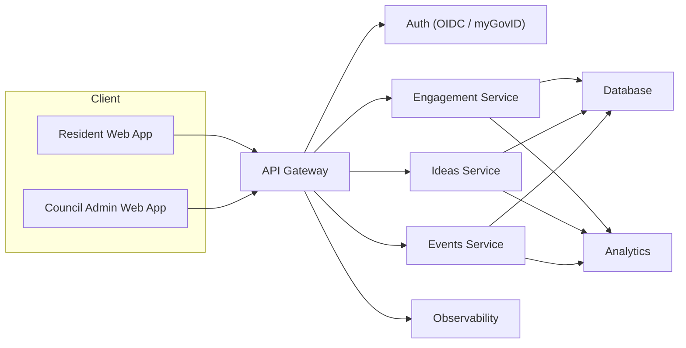

# CommunityLink

## Problem Statement

**Bridging Social Divides: Strengthening Social Connections in Australia**

How can we bring people together from diverse backgrounds to communicate respectfully, even when they hold opposing views?

Social cohesion is the “glue” that binds society together. Cohesive societies are healthier, more resilient, and experience greater prosperity. While Australians have historically come together in times of crisis, recent reports (Scanlon Institute 2023, 2024) show a decline in cohesion — with the Scanlon-Monash Index dropping to its lowest score since 2007.

Key dimensions of cohesion include:

* **Belonging** – pride and connection to Australian life and culture
* **Worth** – emotional and material well-being across society
* **Inclusion & Justice** – fairness in society and trust in government
* **Participation** – active engagement in political and civic life
* **Acceptance & Rejection** – attitudes to diversity and experiences of discrimination

This project addresses the **GovHack challenge**: to design initiatives that strengthen community connection, trust in government, and respectful debate. Deliverables should:

* Present a practical idea that can be piloted locally within 6–12 months
* Include a mock-up and evidence-based analysis, using at least one government dataset
* Demonstrate how impact could be measured (trust, belonging, engagement, acceptance, cultural understanding)

---

## Solution Overview

**CommunityLink** is a lightweight demo platform built with React, Vite, and TailwindCSS. It demonstrates a **OneCouncil, multi-tenant approach** to local community engagement.

The solution enables councils to:

* Discover and act on community sentiment
* Provide safe, anonymous channels for ideas and feedback
* Support respectful dialogue without amplifying polarisation
* Track participation and belonging indicators over time

### Key Features

* **OneCouncil, Multi-Tenant:** Single user experience, council selection during onboarding
* **Dual User Model:** Residents and Council Admins with tailored dashboards
* **Aggregated, Anonymous Engagement:** Protects privacy while surfacing actionable insights
* **Respectful Dialogue:** Sentiment aggregation reduces prominence of divisive content
* **AI Summariser (Demo):** Shows how AI can assist in framing proposals

---

## Technical Design

### Demo Stack

* **Frontend:** React (JSX), Vite
* **Styling:** TailwindCSS
* **Data:** LocalStorage + static mock data (`src/mockData/`)

### Production Stack (Recommended)

* **Frontend:** React served via CDN
* **API:** REST/GraphQL (serverless or containers)
* **Auth:** OIDC / myGovID (strong identity proofing)
* **Database:** Managed Postgres or NoSQL with tenant separation
* **Cache/Session:** Redis
* **Storage:** S3-compatible for attachments
* **Analytics:** Time-series DB or OLAP store

### Architecture & Privacy

* Tenancy stored per user → scoped council context
* Auth (demo): simulated myGovID; production → OIDC provider
* Participation & sentiment → aggregated charts (demo in SVG, client-side)
* Privacy: no PII stored; demo uses static data. Production must enforce encryption, access control, aggregation thresholds, k-anonymity/differential privacy, and compliance with records laws.

### Security

* TLS everywhere, least-privilege IAM, centralised monitoring & alerting
* Secure defaults and dependency monitoring

---

## User Journeys

**Residents**

* Sign in and select council
* Set preferences, browse events, register interest
* Submit ideas (AI summary assist)
* Vote/comment on proposals (Support / Neutral / Oppose)
* Access simple council service flows (waste, parking, rates)

**Council Admins**

* Dashboard with belonging/trust scores and engagement snapshots
* Participation chart + sentiment hub
* View aggregated, anonymised signals to prioritise engagement

---

## System Architecture (Prod)


**Notes (prod):**

* Tokens/sessions live in **HttpOnly, Secure, SameSite cookies** (gateway creates/rotates). No LocalStorage.
* **Tenant context** is derived server-side from identity → enforced via Postgres **RLS** or schema-per-tenant.
* Read paths for dashboards go through **Privacy/Aggregation Layer** so only thresholded, anonymised numbers ever reach clients.

---

## API Surface (concise)

### Auth & Session

| Method | Path                           | Description                                  | Auth           |
| ------ | ------------------------------ | -------------------------------------------- | -------------- |
| `GET`  | `/auth/start?provider=mygovid` | Begin OIDC flow                              | Public         |
| `GET`  | `/auth/callback`               | OIDC callback → sets HttpOnly session cookie | Public         |
| `POST` | `/auth/logout`                 | Clears session                               | Session cookie |

### Resident – Events/Prefs

| Method | Path                                                    | Description                                     |
| ------ | ------------------------------------------------------- | ----------------------------------------------- |
| `GET`  | `/api/v1/events?lga={id}&from=YYYY-MM-DD&to=YYYY-MM-DD` | List public events (tenant-scoped)              |
| `POST` | `/api/v1/events/{eventId}/interest`                     | Register interest                               |
| `GET`  | `/api/v1/preferences`                                   | Get user prefs                                  |
| `PUT`  | `/api/v1/preferences`                                   | Update prefs (categories, accessibility, times) |

**Example payloads**

```json
// PUT /api/v1/preferences
{
	"categories": ["arts_culture","sports"],
	"age_group": "18_34",
	"availability": ["weeknights","weekend_mornings"],
	"accessibility": ["step_free","quiet_space"]
}
```

### Resident – Ideas & Feedback

| Method | Path                         | Description                                 |
| ------ | ---------------------------- | ------------------------------------------- |
| `POST` | `/api/v1/ideas`              | Submit an idea (text + optional attachment) |
| `POST` | `/api/v1/ideas/{id}/vote`    | { "vote": "support|neutral|oppose" }     |
| `POST` | `/api/v1/ideas/{id}/comment` | Short, moderated comment                    |
| `POST` | `/api/v1/ideas/summarise`    | (Server-side) AI summary helper             |

**Example payloads**

```json
// POST /api/v1/ideas
{
	"title": "Pop-up multicultural food night",
	"body": "Partner with local groups to host monthly events in the town square.",
	"tags": ["belonging","youth","food"],
	"location_lga": "Whitehorse"
}

// POST /api/v1/ideas/summarise
{
	"text": "Partner with local groups to host monthly multicultural food nights..."
}
```

**Example responses**

```json
// 201 Created (idea)
{
	"id": "idea_01HZX...",
	"status": "received",
	"moderation": "pending"
}

// 200 OK (summary)
{
	"summary": "Monthly multicultural food nights to foster belonging and cross-cultural exchange.",
	"key_points": ["low-cost pilots", "partner local groups", "youth focus"]
}
```

### Admin – Cohesion & Engagement (Aggregated Only)

| Method | Path                                                  | Description                             |
| ------ | ----------------------------------------------------- | --------------------------------------- |
| `GET`  | `/api/v1/engagement/participation?lga={id}&months=12` | Time series index (aggregated)          |
| `GET`  | `/api/v1/engagement/sentiment?lga={id}`               | Aggregated sentiment per project/topic  |
| `GET`  | `/api/v1/ideas?lga={id}`                              | List ideas + vote tallies (thresholded) |

**Example responses**

```json
// GET /api/v1/engagement/participation
{
	"lga": "Whitehorse",
	"series": [
		{"month": "2024-01", "index": 62},
		{"month": "2024-02", "index": 64},
		{"month": "2024-03", "index": 67}
	],
	"method": "z-scored composite (events, ideas, votes, visits)"
}

// GET /api/v1/engagement/sentiment
{
	"lga": "Whitehorse",
	"topics": [
		{"topic": "parks_upgrade", "support": 132, "neutral": 41, "oppose": 28, "n": 201},
		{"topic": "night_markets", "support": 98, "neutral": 22, "oppose": 11, "n": 131}
	],
	"min_threshold": 10
}
```

---

## Mock Data (this repo) → how it maps

| File                                | Purpose                                          | Used by                               |
| ----------------------------------- | ------------------------------------------------ | ------------------------------------- |
| `src/mockData/participation.json`   | 12-month participation index (demo)              | Admin dashboard chart                 |
| `src/CouncilDashboard.jsx` (inline) | Mock sentiment tiles & topic rollups             | Admin dashboard                       |
| `src/App.jsx` → “SubmitIdeaBot”     | Simulated AI summary response                    | Idea flow                             |
| `src/Onboarding.jsx` (demo only)    | Stores `communityLink_council` during onboarding | To be replaced by server-side tenancy |

**Example `participation.json` (trimmed)**

```json
[
	{"month":"2024-01","index":62},
	{"month":"2024-02","index":64},
	{"month":"2024-03","index":67}
]
```

---

## Data & Privacy Rules (enforced in services)

* **Write paths** (ideas, votes, comments) → authenticated identity; PII stored server-side only, never returned to clients.
* **Read paths** for dashboards → served **only** via Aggregation Layer: thresholded counts, no raw events.
* **Tenancy** via RLS/schema-per-tenant; every query scoped by `tenant_id`.
* **Sessions** in HttpOnly cookies; optional short-lived access tokens mirrored in memory.


## Benefits

* Strengthens belonging and connection
* Builds trust in government through transparency
* Encourages constructive dialogue over polarisation
* Practical for roll-out in 6–12 months

---

## Getting Started

**Prerequisites:** Node.js (LTS), npm

Run locally:

```bash
cd communityLink
npm install
npm run dev
# open http://localhost:5173
```

Build for production:

```bash
npm run build
npm run preview
```

---

## Key Files

* `src/App.jsx` → main app routes & flows
* `src/CouncilDashboard.jsx` → admin dashboard, charts, sentiment tiles
* `src/Onboarding.jsx` → council selection & onboarding
* `src/CouncilLogin.jsx` → admin login stub
* `src/mockData/participation.json` → mock participation data
* `src/ProblemStatment.txt` → full challenge brief
* `tailwind.config.js`, `postcss.config.js` → styling configs

---

## Roadmap

**Short-term:**

* Add lightweight backend (serverless) for anonymised metrics
* Real identity integration (myGov/OIDC)
* Add automated tests

**Mid-term:**

* Tenant data separation & RBAC for admins
* Privacy-preserving aggregation (k-anonymity, differential privacy)
* CSV export and policy dashboards

**Long-term:**

* Integrate government datasets (per challenge brief)
* Advanced analytics: segmentation, cohort analysis, impact measurement

---

## License

Govhack demo project. See repo metadata for license notes. Add an explicit license if publishing openly.

